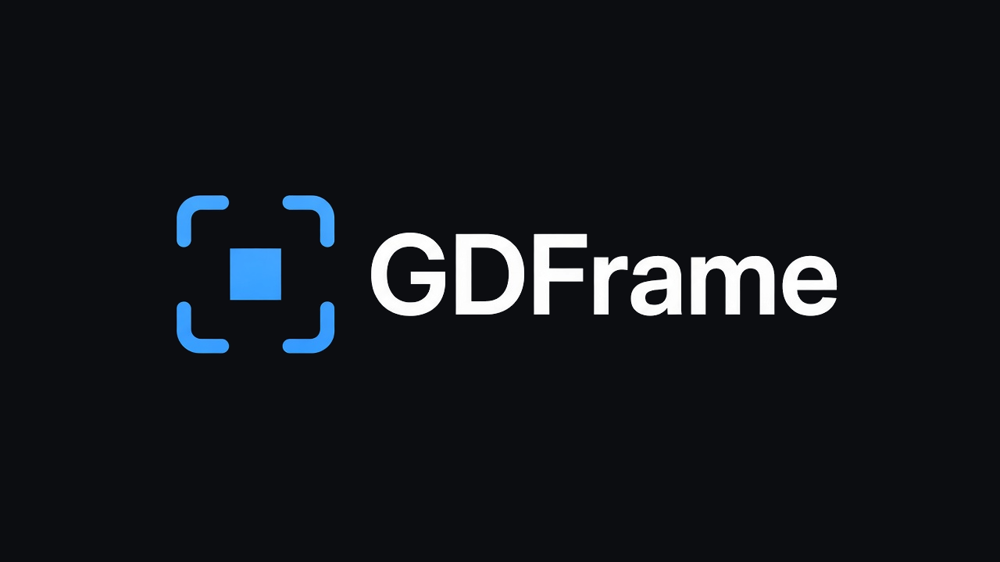

<p align="center">
  
</p>
<p align="center">
  <a href="LICENSE"></a>
  <a href="https://docs.godotengine.org/en/stable/tutorials/scripting/gdscript/index.html"></a>
  <a href="https://godotengine.org/"></a>
  <a href="https://github.com/ftyu3d/gdframe/stargazers"></a>
</p>

# GDFrame

**面向 Godot 的轻量、高性能、可开箱即用的游戏基础框架**——用统一的服务对象与编辑器 Dock，把 UI、输入、存档、设置、音频、暂停、对象池与状态机等通用能力收敛到插件里，让你专注玩法与内容。

启用插件后注册 Autoload **`GDFrame`**。业务通过 `GDFrame.ui`、`GDFrame.save`、`GDFrame.audio`、`GDFrame.fsm` 等服务调用；类型注解用 **`GDFrameRoot`**。工程目录为 **`res://gdframe_project/`**。

## 功能

| 模块 | 说明 |
|------|------|
| **UI** | `GDFrame.ui`：预加载 / 打开 / 关闭、图层栈、dim、Esc 关闭、手柄/键盘焦点导航 |
| **Input** | `GDFrame.input`：当前输入设备（键鼠 / 手柄 / 触屏）与导航焦点策略 |
| **Save** | `GDFrame.save`：用户目录 profile + 多槽位 `Resource`，原子写与损坏恢复 |
| **Settings** | `GDFrame.settings`：窗口模式、分辨率、垂直同步、帧率上限、语言（写入 profile） |
| **Audio** | `GDFrame.audio`：BGM 交叉淡入、SFX 池与限流、UI Polyphonic、2D/3D 音效 |
| **Pause** | `GDFrame.pause`：多 reason 暂停栈，同步 `get_tree().paused` 与音频暂停 |
| **Pool** | `GDFrame.pool`：场景对象池，编辑器 Debugger 统计 |
| **FSM** | `GDFrame.fsm`：Registry + 状态脚本，按 owner 绑定，首次访问时加载 |
| **Ext** | 可选扩展模块，按需安装（见 [GDFrame Ext](https://github.com/ftyu3d/gdframe-ext) / [Gitee](https://gitee.com/ftyu3d/gdframe-ext)） |

## 安装

1. 从 [GitHub Releases](https://github.com/ftyu3d/gdframe/releases) 或 [Gitee Releases](https://gitee.com/ftyu3d/gdframe/releases) 下载 **`gdframe.zip`**，解压到 Godot **工程根目录**。
2. 或将本仓库 **`addons/gdframe/`** 复制到工程的 **`addons/gdframe/`**。
3. 打开 **项目 → 项目设置 → 插件**，启用 **GDFrame**。
4. 首次启用会在 **`res://gdframe_project/`** 自动生成工程目录与 `GDFrameConstants`；之后即可使用 `GDFrame` 与 `GDFrameConstants`。

要求 **Godot 4.7+**。

```powershell
powershell -ExecutionPolicy Bypass -File tools/pack_release.ps1
# 或 Windows: .\tools\pack_release.bat
# 或 macOS/Linux: ./tools/pack_release.sh
```

产出 `dist/gdframe.zip`（内含 `addons/gdframe/...`，解压到工程根目录）。

## 快速开始

```gdscript
func _ready() -> void:
	# 业务 signal 须在 gdframe_signals.gd 中声明
	await GDFrame.ui.preload_ui(GDFrameConstants.UI_EXAMPLE)
	GDFrame.ui.open(GDFrameConstants.UI_EXAMPLE)
```

UI 场景放在 **`GDFrameConfig.UI_ROOT_DIR`**（`ui_*.tscn`，根脚本 `extends GDFrameUIBase`）；层与遮罩见 [editor/README.md](addons/gdframe/editor/README.md#图层与遮罩)。状态机在 **`GDFrameConfig.FSM_ROOT`**，首次访问 `GDFrame.fsm` 时加载。

## 文档

- **[editor/README.md](addons/gdframe/editor/README.md)** — API 参考、配置项、编辑器 Dock、存档/音频/UI/FSM
- **[GDFrame Ext](https://github.com/ftyu3d/gdframe-ext)** — 可选扩展模块（[Gitee](https://gitee.com/ftyu3d/gdframe-ext)）

## 许可证

[MIT](LICENSE) © Feng Yang
